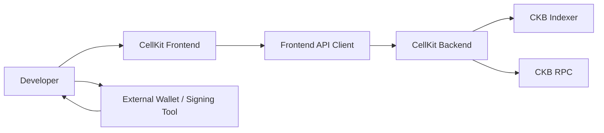
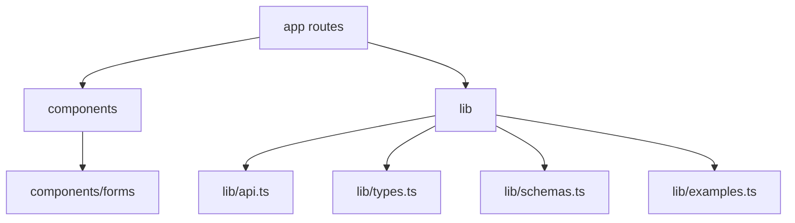
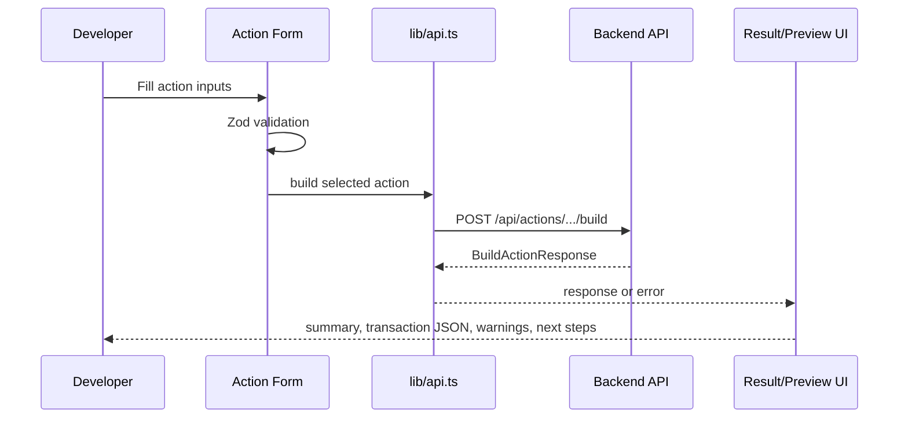
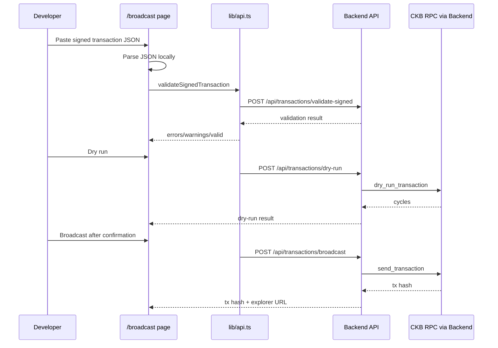

# CellKit Actions Frontend Architecture

This document explains how the CellKit frontend is structured and how users move through the transaction-action workflow.

## Purpose

CellKit Actions Frontend is the browser-based developer interface for CellKit. It helps developers:

- Discover available CKB transaction actions
- Submit developer-friendly action inputs
- Inspect backend-generated transaction JSON
- Copy unsigned payloads for external signing
- Paste signed transaction JSON
- Validate, dry-run, and broadcast signed testnet transactions

The frontend does not sign transactions and does not handle private keys.

## System Context



The frontend is a guided interface over the backend API. External signing remains outside CellKit.

## Page Map

```mermaid
flowchart TD
    Home[/ /] --> Playground[/playground]
    Home --> Actions[/actions]
    Home --> Broadcast[/broadcast]
    Home --> APIRef[/api-reference]
    Actions --> ActionDetail[/actions/[actionId]]
    ActionDetail --> Playground
    Playground --> Broadcast
```

Page responsibilities:

- `/` introduces the project and primary workflow.
- `/playground` builds unsigned action payloads.
- `/actions` lists MVP action templates.
- `/actions/[actionId]` documents individual action fields and examples.
- `/broadcast` validates, dry-runs, and broadcasts signed transaction JSON.
- `/api-reference` provides endpoint examples and curl snippets.

## Frontend Module Map



Key files:

- `lib/api.ts` centralizes backend requests and API error shaping.
- `lib/types.ts` mirrors backend response types.
- `lib/schemas.ts` validates form inputs with Zod.
- `lib/examples.ts` provides local action metadata and examples.
- `components/forms/*` contains action-specific forms.
- `components/TransactionPreview.tsx` renders transaction JSON sections.
- `components/BroadcastResult.tsx` renders validation/dry-run/broadcast results.

## Unsigned Transaction Build Flow



The transaction preview keeps CKB JSON visible instead of hiding the Cell Model behind a black box.

## Signed Transaction Broadcast Flow



Broadcast requires explicit user action and confirmation in the UI.

## API Boundary

The frontend reads its backend URL from:

```text
NEXT_PUBLIC_API_URL
```

Default:

```text
http://localhost:8080
```

The frontend treats backend errors as first-class UI states. It shows missing config, invalid transaction shape, dry-run failure, and broadcast errors as visible user-facing feedback.

## Security Boundaries

The frontend does not:

- Connect wallets
- Ask for private keys
- Ask for seed phrases
- Sign transactions
- Store credentials
- Custody funds

The frontend does:

- Validate form inputs before sending requests
- Parse signed transaction JSON before API submission
- Show backend validation errors
- Ask for confirmation before broadcast
- Display dry-run and broadcast results visibly

## Verification Strategy

Automated checks:

```bash
pnpm lint
pnpm build
```

Manual checks:

1. Open `/playground`.
2. Submit a CKB transfer request against a configured backend.
3. Confirm the transaction preview renders.
4. Copy transaction JSON for external signing.
5. Open `/broadcast`.
6. Paste signed transaction JSON.
7. Validate, dry-run, and broadcast on CKB testnet.
8. Confirm tx hash and explorer URL display.
